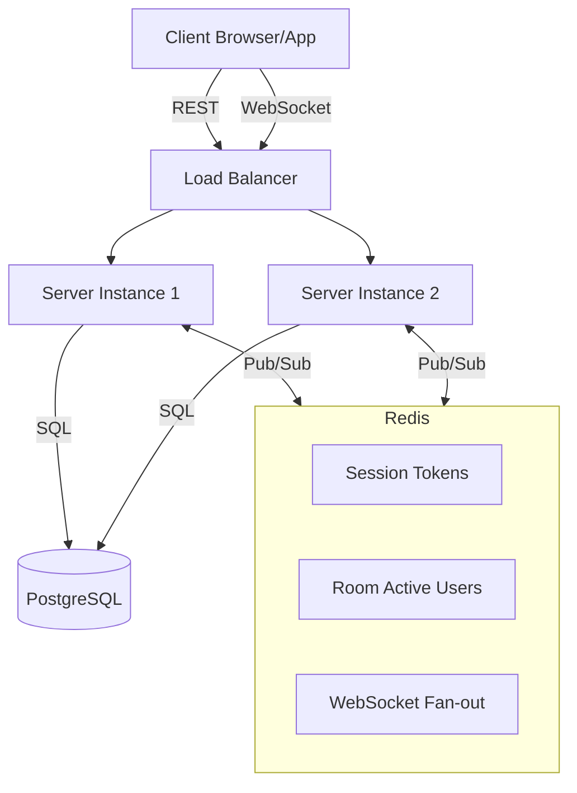

# Architecture Documentation

## Overview

The Anonymous Chat API is built with a focus on real-time reliability and horizontal scalability. It uses **NestJS** as the core framework, **PostgreSQL** for persistence, and **Redis** for state management and inter-service communication.

### Interaction Diagram

## Session Strategy

- **Generation**: When a user logs in, a high-entropy `nanoid` (32 characters) is generated as an opaque session token.
- **Storage**: The token is stored in Redis as a key (`session:<token>`) with the user's ID as the value.
- **Expiry**: Tokens are set with a TTL of 86,400 seconds (24 hours). Every login generates a fresh token.
- **Validation**: The `AuthGuard` extracts the token from the `Authorization: Bearer` header and performs a $O(1)$ lookup in Redis.

## WebSocket Scaling

To handle fans-out across multiple server instances, we use two mechanisms:

1. **Redis Adapter**: The `@socket.io/redis-adapter` is used for internal Socket.io signaling (e.g., when a client joins a room on one instance, others are aware).
2. **Manual Pub/Sub**: For message broadcasting, the REST API publishes to a Redis channel (`message:new`). Every server instance subscribes to this channel. When a message is received from Redis, the instance checks if it has any clients connected to that `roomId` and emits the event locally. This ensures that a message sent via REST is received by all WebSocket clients regardless of which instance they are connected to.

## Capacity Estimation

### Single Instance Capacity
On a single instance with 1 vCPU and 2GB RAM:
- **Concurrent Connections**: Estimated **10,000 to 15,000** concurrent WebSocket connections.
- **Reasoning**: Node.js can handle a large number of idle sockets. The bottleneck is typically memory (each socket takes ~10-20KB) and the event loop if message frequency is extremely high.
- **Throughput**: ~2,000 - 5,000 requests per second for REST endpoints.

## Scaling to 10× Load

To scale to 100,000+ concurrent users:
1. **Load Balancing**: Use an L7 load balancer (Nginx/HAProxy) with "sticky sessions" or "ip_hash" to ensure WebSocket stability (though Socket.io can work without it if configured properly).
2. **Redis Cluster**: Move from a single Redis instance to a Redis Cluster to handle the increased Pub/Sub and session lookup traffic.
3. **Database Read Replicas**: Use Drizzle with a read-replica configuration for `GET /rooms` and `GET /messages` to offload the primary PostgreSQL instance.
4. **Horizontal Scaling**: Deploy the NestJS application as a containerized service (K8s/ECS) with auto-scaling based on CPU/Memory/Connection count.

## Limitations & Trade-offs

- **Memory Sessions**: While Redis is fast, if it goes down, all users are logged out.
- **Message Ordering**: In a multi-instance setup, there's a theoretical risk of slight message reordering if network latency between Redis and instances varies significantly, though PostgreSQL timestamps help mitigate this in history.
- **Active User Count**: Pulling active user counts from Redis on every `GET /rooms` request is fast but can be optimized with caching if the room list becomes massive.
